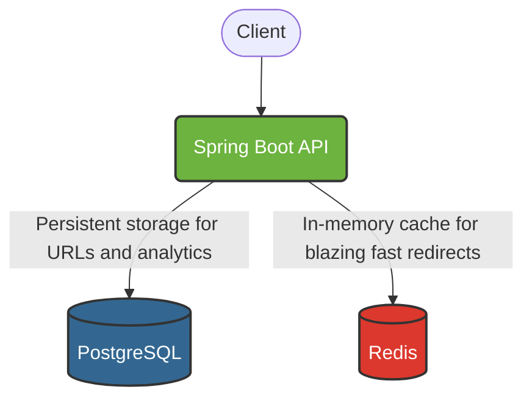

# Scalable Spring Boot URL Shortener

A high-performance RESTful API that generates short, shareable links from long URLs. This backend service is built with Java and Spring Boot, utilizing PostgreSQL for persistent data storage and Redis for high-speed redirect caching. 

The infrastructure is fully containerized using Docker Compose for seamless local development.

## Big Picture Architecture



## Tech Stack

| Component | Technology |
| :--- | :--- |
| **Language** | Java 21 |
| **Framework** | Spring Boot, Spring Web, Spring Data JPA |
| **Database** | PostgreSQL |
| **Caching** | Redis, Spring Data Redis |
| **Infrastructure**| Docker & Docker Compose |
| **Tools** | Lombok, Hibernate Validation |

## ✨ Features

* **Short Link Generation:** Converts long URLs into unique, 6-8 character Base62 short codes.
* **Fast Redirects:** Uses Redis caching to serve frequent redirects without hitting the database.
* **Click Analytics:** Tracks click counts and metadata (creation date) for every shortened URL.
* **Containerized Infrastructure:** Database and cache are spun up instantly via Docker Compose.

---

##  Getting Started

### Prerequisites
* Java 21 installed
* Maven installed (or use the provided Maven wrapper)
* Docker and Docker Compose installed

### 1. Start the Infrastructure
Run the following command to start the PostgreSQL database and Redis cache:
```bash
docker compose up -d
```

### 2. Run the Application
Start the Spring Boot application using Maven:
```bash
./mvnw spring-boot:run
```
The API will be available at `http://localhost:8080`.

---

## API Documentation

### 1. Create a Short URL
Generates a new short code for a given URL.

**Request:** `POST /api/urls`
```json
{
  "originalUrl": "https://www.youtube.com/watch?v=CsvqR5_Bv3E"
}
```

**Response:** `200 OK`
```json
{
  "shortCode": "8cUUPwXh",
  "shortUrl": "http://localhost:8080/8cUUPwXh"
}
```

### 2. Redirect to Original URL
Visiting the short link will increment the click count and redirect the user.

**Request:** `GET /{shortCode}`
* **Response:** `302 Found` (Redirects to the original URL)
* *Cache Logic: First checks Redis. On cache miss, fetches from PostgreSQL and caches the result.*

### 3. Get URL Metadata
Fetch details about a specific short URL.

**Request:** `GET /api/urls/{shortCode}`
```json
{
  "originalUrl": "https://www.youtube.com/watch?v=CsvqR5_Bv3E",
  "shortCode": "8cUUPwXh",
  "createdAt": "2023-10-25T14:30:00",
  "clickCount": 42
}
```

### 4. Get Click Analytics
Fetch isolated analytics for a short link.

**Request:** `GET /api/urls/{shortCode}/analytics`
```json
{
  "clickCount": 42,
  "createdAt": "2023-10-25T14:30:00"
}
```

---

## Roadmap & Future Improvements

While the core functionality and caching layers are complete, the following features are planned for future iterations:

* **Advanced Features:** Support for custom aliases (e.g., `localhost:8080/my-custom-link`) and expiration dates.
* **Rate Limiting:** Implement rate limiting to prevent abuse, bot spam, or DDoS attacks on the link creation endpoint.
* **User Authentication:** Add Spring Security with **JWT (JSON Web Tokens)** so users can create accounts, manage their custom links, and view their personal analytics dashboards.
* **User Dashboard:** Build a responsive frontend using **React.js** or **Next.js** and **Tailwind CSS**.
* **Cloud Deployment:** Migrate from local Docker to **AWS**.


***
